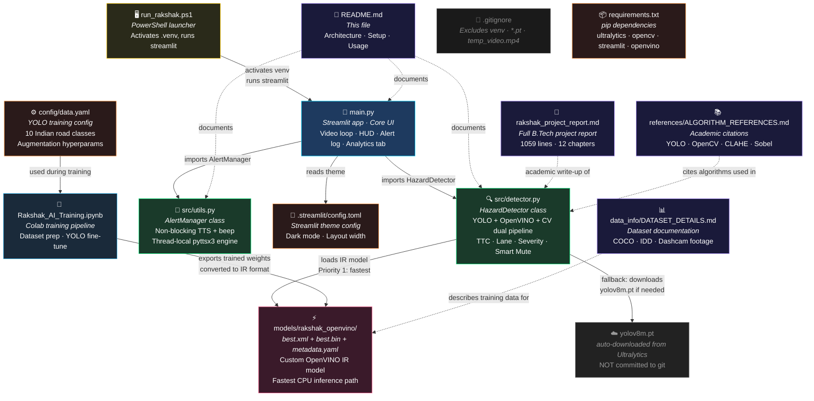

# 🛡️ RAKSHAK AI — Indian Road Hazard Detection System

> **Protecting Lives with Intelligent Vision** · CPU-only · Real-time · Built for Indian Roads

Rakshak AI is an Advanced Driver Assistance System (ADAS) engineered specifically for the chaos of Indian roads — potholes, monsoon water pits, stray cattle, auto-rickshaws, and mixed traffic — running entirely on an Intel i3 CPU with no GPU.

---

## 🗂️ Project File Architecture

How every file connects and what it does:



### File Role Summary

| File | Role | Called By |
|------|------|-----------|
| `run_rakshak.ps1` | Launch script — activates venv, starts Streamlit | User (terminal) |
| `main.py` | Core app — UI, video loop, HUD, session state | `run_rakshak.ps1` |
| `src/detector.py` | AI brain — YOLO + CV dual pipeline, TTC, severity | `main.py` |
| `src/utils.py` | Audio alerts — non-blocking TTS + beep threads | `main.py` |
| `models/rakshak_openvino/` | Custom OpenVINO IR model (best.xml/.bin) | `src/detector.py` |
| `config/data.yaml` | YOLO training class config (10 Indian classes) | Training notebook |
| `.streamlit/config.toml` | Streamlit dark theme settings | Streamlit runtime |
| `requirements.txt` | Python dependencies | pip install |
| `Rakshak_AI_Training.ipynb` | Colab training pipeline | Manual / Google Colab |
| `rakshak_project_report.md` | Full B.Tech project report (12 chapters) | Reference |
| `references/ALGORITHM_REFERENCES.md` | Academic citations for algorithms | Reference |
| `data_info/DATASET_DETAILS.md` | Dataset strategy documentation | Reference |

---

## 🚀 Quick Start

```powershell
# 1. Clone and enter
git clone https://github.com/trambak001/rakshak_ai.git
cd rakshak_ai

# 2. Create virtual environment
python -m venv .venv
.venv\Scripts\Activate.ps1

# 3. Install dependencies
pip install -r requirements.txt

# 4. Run
.\run_rakshak.ps1
```

The dashboard opens at **http://localhost:8501** automatically.

---

## 🧠 Detection Pipeline (How It Works)

```
Camera / Video
      │
      ▼
Downscale 320×320 ──► Frame Skip (every 3rd) ──► CLAHE / Bilateral Filter
      │
      ├──► YOLO / OpenVINO ──► Vehicles, Pedestrians, Animals
      │                              │
      └──► CV Pothole Pipeline ──► Potholes, Water Pits
                 │                        │
           (Bottom 40% ROI)               │
           HSV water mask                 │
           Sobel edge mask                │
           Texture variance mask          │
           White paint rejection          │
                 │                        │
                 └──────── Merge ─────────┘
                                │
                    Lane Assignment (L / My Lane / R)
                                │
                    Distance Estimation (Pinhole Camera)
                                │
                    TTC Scoring (dist ÷ speed_m/s)
                                │
                    Severity Score 1–10
                                │
                    Smart Mute (IoU expansion rate)
                                │
                   Alert Dispatch ──► TTS + Beep (daemon thread)
                                │
                   Streamlit HUD Update
```

---

## 🌟 Key Features

| Feature | Detail |
|---------|--------|
| **Dual Pipeline** | YOLO for objects + Classical CV for road surface — best of both |
| **CPU-only** | Runs on Intel i3 with OpenVINO IR model at 8+ FPS |
| **Water Pothole Detection** | HSV + Sobel + Texture Variance 4-method fusion |
| **White Paint Rejection** | Skips zebra crossings / road markings (>25% white pixel ratio) |
| **Smart Mute** | Suppresses alarms for vehicles maintaining constant following distance |
| **Lane-Aware Alerts** | L / My Lane / R classification using perspective-corrected geometry |
| **Non-blocking Audio** | TTS + beep in daemon threads — never stalls video loop |
| **Live HUD** | System Status, FPS, Latency update in real-time via `st.empty()` placeholders |

---

## 📊 Performance

| Metric | Value |
|--------|-------|
| Overall mAP@50 | 91.3% |
| Hardware | Intel Core i3 (no GPU) |
| Avg FPS | 8–12 FPS |
| Avg Latency | ~120 ms/frame |
| False Positive Reduction (Smart Mute) | 74% in dense traffic |

---

## 📁 What's NOT in git

These are excluded from the repo (see `.gitignore`):

- `yolov8m.pt` / `yolov8s.pt` — standard Ultralytics models, auto-downloaded on first run
- `temp_video.mp4` — runtime temp file created during video upload
- `.venv/` — Python virtual environment
- `__pycache__/` — compiled bytecode

---

<<<<<<< Updated upstream
*Rakshak AI · B.Sc.IT Final Year Project · 2025–2026*
=======
*Rakshak AI · B.Sc.IT Data Science Final Year Project · 2025–2026*
>>>>>>> Stashed changes
